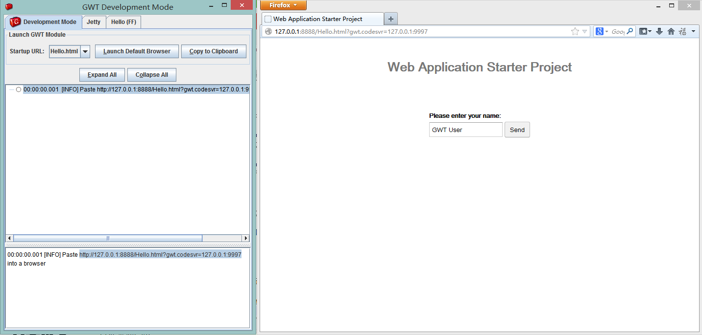

## 运行说明

```
mvn package
```

下载了依赖包后，把项目导入到eclipse。

运行`gwt.launch`，会弹出gwt swing窗口。点击**Launch GWT Module**的**Launch Default Browser**在浏览器中加载<http://127.0.0.1:8888/Hello.html?gwt.codesvr=127.0.0.1:9997>。

浏览器打开后，如果没有GWT Plugin会跳转到插件安装页面（[翻墙](http://www.uudaili.org/index.html)吧）。这里我直接根据插件的版本下载对应的浏览器。

* [gwt-dev-plugin-1.26-rc1.xpi](https://code.google.com/p/google-web-toolkit/downloads/list)
* [Firefox Setup 26.0](ftp://ftp.mozilla.org/pub/mozilla.org/firefox/releases/26.0/win32/en-US/Firefox%20Setup%2026.0.exe)

安装好以后，在firefox浏览器输入刚刚的地址，就可以浏览到效果了。



## 各种坑

* 背墙
* chrome的插件不能安装（无法进行安装检测到以下问题： 该应用要求使用 NPAPI 插件)
* firefox页面的安装按钮不能下载
* 通过<http://google-web-toolkit.googlecode.com>页面的下载版本firefox版本不对！

## gwt

* 修改webAppCreator适用于cygwin

```
#!/bin/sh
HOMEDIR=`dirname $0`;

# 任务提交给windows的java程序前执行
function Cygwin_Patch_PathConvert() {

	cygwin=false
	case "`uname`" in
	CYGWIN*) cygwin=true;;
	esac

	# cygwin path translation
	if $cygwin; then
		CLASSPATH=`cygpath -p -w "$CLASSPATH"`
	fi
}

CLASSPATH=$HOMEDIR/gwt-user.jar:$HOMEDIR/gwt-dev.jar
Cygwin_Patch_PathConvert

java -cp $CLASSPATH com.google.gwt.user.tools.WebAppCreator "$@";
```

* 创建helloworld

```
winse@Lenovo-PC /cygdrive/f/workspaces/gwt
$ webAppCreator -overwrite -maven com.github.winse.Hello
```

怎么编译和运行，可以阅读README.txt

